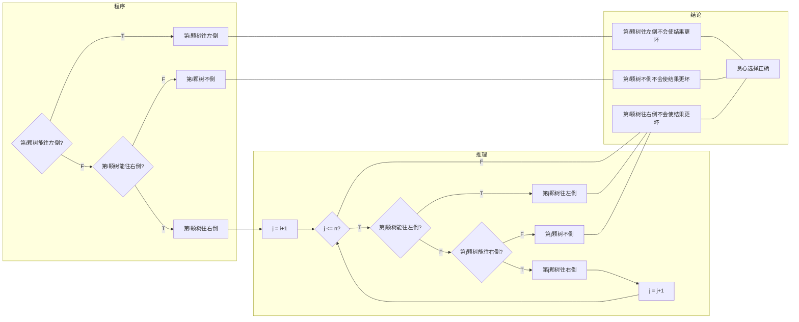

# 545C. Woodcutters

dp/greedy, 1500, https://codeforces.com/problemset/problem/545/C

Little Susie listens to fairy tales before bed every day. Today's fairy tale was about wood cutters and the little girl immediately started imagining the choppers cutting wood. She imagined the situation that is described below.

There are *n* trees located along the road at points with coordinates *x*~1~, *x*~2~, ..., *x~n~*. Each tree has its height *h~i~*. Woodcutters can cut down a tree and fell it to the left or to the right. After that it occupies one of the segments [*x~i~* - *h~i~*, *x~i~*] or [*x~i~*;*x~i~* + *h~i~*]. The tree that is not cut down occupies a single point with coordinate *x~i~*. Woodcutters can fell a tree if the segment to be occupied by the fallen tree doesn't contain any occupied point. The woodcutters want to process as many trees as possible, so Susie wonders, what is the maximum number of trees to fell.

**Input**

The first line contains integer *n* (1 ≤ *n* ≤ 10^5^) — the number of trees.

Next *n* lines contain pairs of integers *x~i~*, *h~i~* (1 ≤ *x~i~*, *h~i~* ≤ 10^9^) — the coordinate and the height of the *і*-th tree.

The pairs are given in the order of ascending *x~i~*. No two trees are located at the point with the same coordinate.

**Output**

Print a single number — the maximum number of trees that you can cut down by the given rules.

Examples

input

```
5
1 2
2 1
5 10
10 9
19 1
```

output

```
3
```

input

```
5
1 2
2 1
5 10
10 9
20 1
```

output

```
4
```

Note

In the first sample you can fell the trees like that:

- fell the 1-st tree to the left — now it occupies segment [ - 1;1]
- fell the 2-nd tree to the right — now it occupies segment [2;3]
- leave the 3-rd tree — it occupies point 5
- leave the 4-th tree — it occupies point 10
- fell the 5-th tree to the right — now it occupies segment [19;20]

In the second sample you can also fell 4-th tree to the right, after that it will occupy segment [10;19].


思路：如果一颗树可以向左倒而不与前一棵树重叠，就选择向左倒。否则，如果可以向右倒而且不与下一棵树重叠，就选择向右倒。如果都不可以，则该树保持不砍的状态。

2020fall-cs101-陈彦如

因为要让更多的树被砍到，而一棵树是否被砍倒只与临近的两颗树相关，所以能倒就倒，不能往左就往右，所以直接暴力判断了。（向右倒会占用下一棵树左边的空间，所以要比向左边倒的情况多考虑一点！）

```python
n = int(input())
s = [[int(x) for x in input().split()] for i in range(n)]
count = 2
if n == 1:
    print(1)
else:
    for i in range(1, n-1):
        if s[i][0] - s[i-1][0] > s[i][1]:
            count += 1
        elif s[i+1][0] - s[i][0] > s[i][1]:
            count += 1
            s[i][0] += s[i][1]
    
    print(count)
```


2020fall-cs101-黄旭

解题思路：先首尾两棵树肯定是可以砍的，接下来中间的树肯定是能砍就尽量砍，然后记录砍树之后的被占用最大值即可。

```python
x = int(input())
lt = []
n = 0
for i in range(x):
    lt.append([int(i) for i in input().split()])

for i in range(1,x-1):
    a, b = lt[i]
    if a - b > lt[i-1][0]:
        n += 1
    elif a+b < lt[i+1][0]:
        n += 1
        lt[i][0] = a + b
print([n+1,n+2][x!=1])
```


```python
n = int(input())

xh_pair = []
for i in range(n):
    x,h = map(int,input().split())
    xh_pair.append((x,h))
    
nCount = 1
pre = xh_pair[0][0]
for index in range(1,n-1):
    i = xh_pair[index]
    j = xh_pair[index+1]
    if i[0]-pre>i[1]:
        nCount += 1
        pre = i[0]
        #print(i)
        continue
    if i[0]+i[1]<j[0]:
        nCount += 1
        #print(i)
        pre = i[0]+i[1]
        continue
    

    pre = i[0]

if n==1:
    print(1)
else:
    print(nCount+1)
```

2021fall-cs101-吉祥瑞

https://codeforces.com/problemset/problem/545/C

解题思路：贪心策略是从左到右遍历每颗树，若能往左倒就往左倒，若不能往左倒但能往右倒就往右倒。原理如下图。



```python
n = int(input())
xh = [[int(a) for a in input().split()] for _ in range(n)]
s = 1
r = -xh[0][1]
for i in range(n-1):
    if xh[i][0]-xh[i][1] > r:
        s += 1
        r = xh[i][0]
    elif xh[i][0]+xh[i][1] < xh[i+1][0]:
        s += 1
        r = xh[i][0]+xh[i][1]
    else:
        r = xh[i][0]
print(s)
```

注：初始时`s = 1`是算入了最后一颗树。`r`用来标记已倒下的树的最右端，初始时`r = -xh[0][1]`是为了让第一颗树一定能往左倒。

心得：通过写两道选做题的解题思路，我有点体会到了贪心算法的共同模式。（1）把问题按某种顺序分解为一次次选择（“充实的寒假生活”(http://cs101.openjudge.cn/practice/16528/)按结束时间从早到晚遍历每个活动，“Woodcutters”从左到右遍历每颗树）；（2）确定每次做选择的策略（“充实的寒假生活”是”若能参加就参加“，“Woodcutters”是“若能往左倒就往左倒，若不能往左倒但能往右倒就往右倒”），使这种策略不会使结果更坏。这里对于贪心选择正确性的推理是“计算机式”的，需要反复迭代，如果要让推理更“数学”，可以用数学归纳法倒过来说。


```python
# DP 许慧琳 23心理与认知科学学院
n = int(input())
trees = []
for _ in range(n):
    c, h = map(int, input().split())
    trees.append([c, h])

if n == 1: # if only have one tree :)
    print(1)
    exit() # break version without while, not recommend in big program, can use sys.exit() to get an error code

# first tree, can always fall
stay = 0
left = 1
right = 1

for i in range(1, n):
    maxi = max(stay, left, right)
    stay = maxi # when i-th stay

    if right == maxi and left != maxi:
        if trees[i][0] - trees[i][1] > trees[i-1][0] + trees[i-1][1]: # special situation, previous one fall right and overlap with the present tree falling left
            left = maxi + 1
        else:
            left = maxi
    else: 
        if trees[i][0] - trees[i][1] > trees[i-1][0]: # can fall left
            left = maxi + 1
        else:
            left = maxi

    if i == n - 1 or (trees[i][0] + trees[i][1]) < trees[i+1][0]: # i-th fall right / the last (to prevent an error like above done bfr)
        right = maxi + 1
    else:
        right = maxi

print(max(stay, left, right))

```


本题dp更显然。

```python
# 高景行 24-数学科学学院
n = int(input())
a = []
for i in range(n):
    x, h = map(int, input().split())
    a.append([x, h])
a.append([float('inf'), 0])
dp = [[0, 0, 0] for _ in range(n)]  # 0 不变 1 left 2 right
if n == 1:
    print(1)
    exit(0)
dp[0][0] = dp[0][1] = 1
if a[0][0] + a[0][1] < a[1][0]: dp[0][2] = 1
for i in range(1, n):
    dp[i][0] = max(dp[i - 1][0], dp[i - 1][1])
    if a[i - 1][0] + a[i - 1][1] < a[i][0]: dp[i][0] = max(dp[i][0], dp[i - 1][2])
    if a[i - 1][0] + a[i][1] < a[i][0]:
        dp[i][1] = max(dp[i - 1][0] + 1, dp[i - 1][1] + 1)
        if a[i - 1][0] + a[i - 1][1] + a[i][1] < a[i][0]: dp[i][1] = max(dp[i][1], dp[i - 1][2] + 1)
    if a[i][0] + a[i][1] < a[i + 1][0]:
        dp[i][2] = max(dp[i - 1][0], dp[i - 1][1]) + 1
        if a[i - 1][0] + a[i - 1][1] < a[i][0]: dp[i][2] = max(dp[i][2], dp[i - 1][2] + 1)
mx = 0
mx = max(mx, dp[n - 1][0], dp[n - 1][1], dp[n - 1][2])
print(mx)
```

这个程序解决的是一个动态规划问题，目标是在给定的一系列点和高度的情况下，计算最多能选择多少个点，使得任意两个被选中的点之间的距离大于这两个点的高度之和。每个点由其位置 \(x\) 和高度 \(h\) 组成。以下是程序的详细解释：

**输入读取**

```python
n = int(input())
a = []
for i in range(n):
    x, h = map(int, input().split())
    a.append([x, h])
a.append([float('inf'), 0])
```

- 首先读取一个整数 \(n\)，表示点的数量。
- 接下来读取 \(n\) 行，每行包含两个整数 \(x\) 和 \(h\)，分别表示点的位置和高度。
- 将这些点存储在一个列表 `a` 中。
- 最后，为了简化边界条件处理，向 `a` 列表末尾添加一个特殊点 `[float('inf'), 0]`，表示一个无限远且高度为0的点。

**动态规划初始化**

```python
dp = [[0, 0, 0] for _ in range(n)] # 0 不变 1 left 2 right
if n == 1:
    print(1)
    exit(0)
dp[0][0] = dp[0][1] = 1
if a[0][0] + a[0][1] < a[1][0]: dp[0][2] = 1
```

- 初始化一个二维列表 `dp`，大小为 $n \times 3$，用于存储动态规划的状态。`dp[i][0]` 表示第 i 个点不改变状态时的最大选择数，`dp[i][1]` 表示第 i 个点向左移动时的最大选择数，`dp[i][2]` 表示第 i 个点向右移动时的最大选择数。
- 如果只有一个点，直接输出1并退出程序。
- 初始化第一个点的状态：`dp[0][0]` 和 `dp[0][1]` 都设为1，表示可以选择第一个点。
- 如果第一个点和第二个点之间的距离大于它们的高度之和，那么 `dp[0][2]` 也设为1，表示第一个点可以向右移动。

**动态规划状态转移**

```python
for i in range(1, n):
    dp[i][0] = max(dp[i - 1][0], dp[i - 1][1])
    if a[i - 1][0] + a[i - 1][1] < a[i][0]: dp[i][0] = max(dp[i][0], dp[i - 1][2])
    if a[i - 1][0] + a[i][1] < a[i][0]:
        dp[i][1] = max(dp[i - 1][0] + 1, dp[i - 1][1] + 1)
        if a[i - 1][0] + a[i - 1][1] + a[i][1] < a[i][0]: dp[i][1] = max(dp[i][1], dp[i - 1][2] + 1)
    if a[i][0] + a[i][1] < a[i + 1][0]:
        dp[i][2] = max(dp[i - 1][0], dp[i - 1][1]) + 1
        if a[i - 1][0] + a[i - 1][1] < a[i][0]: dp[i][2] = max(dp[i][2], dp[i - 1][2] + 1)
```

- 遍历每一个点（从第1个点到第 \(n-1\) 个点）。
- 更新 `dp[i][0]`，表示第 \(i\) 个点不改变状态时的最大选择数。它可以从 `dp[i-1][0]` 或 `dp[i-1][1]` 转移过来，如果前一个点向右移动且不冲突，还可以从 `dp[i-1][2]` 转移过来。
- 更新 `dp[i][1]`，表示第 \(i\) 个点向左移动时的最大选择数。如果前一个点和当前点不冲突，可以从 `dp[i-1][0] + 1` 或 `dp[i-1][1] + 1` 转移过来；如果前一个点向右移动且不冲突，还可以从 `dp[i-1][2] + 1` 转移过来。
- 更新 `dp[i][2]`，表示第 \(i\) 个点向右移动时的最大选择数。如果当前点和下一个点不冲突，可以从 `dp[i-1][0] + 1` 或 `dp[i-1][1] + 1` 转移过来；如果前一个点向右移动且不冲突，还可以从 `dp[i-1][2] + 1` 转移过来。

**输出结果**

```python
mx = 0
mx = max(mx, dp[n - 1][0], dp[n - 1][1], dp[n - 1][2])
print(mx)
```

- 计算并输出最大选择数 `mx`，它是 `dp[n-1][0]`、`dp[n-1][1]` 和 `dp[n-1][2]` 中的最大值。

这个程序通过动态规划的方法，有效地解决了在给定点和高度的情况下，最多能选择多少个点的问题。


