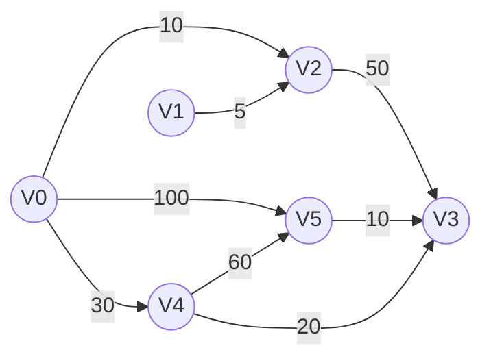

# M05443: 兔子与樱花

dijkstra, Floyd-Warshall, http://cs101.openjudge.cn/practice/05443/

很久很久之前，森林里住着一群兔子。有一天，兔子们希望去赏樱花，但当他们到了上野公园门口却忘记了带地图。现在兔子们想求助于你来帮他们找到公园里的最短路。

**输入**

输入分为三个部分。
第一个部分有P+1行（P<30），第一行为一个整数P，之后的P行表示上野公园的地点, 字符串长度不超过20。
第二个部分有Q+1行（Q<50），第一行为一个整数Q，之后的Q行每行分别为两个字符串与一个整数，表示这两点有直线的道路，并显示二者之间的矩离（单位为米）。
第三个部分有R+1行（R<20），第一行为一个整数R，之后的R行每行为两个字符串，表示需要求的路线。

**输出**

输出有R行，分别表示每个路线最短的走法。其中两个点之间，用->(矩离)->相隔。

样例输入

```
6
Ginza
Sensouji
Shinjukugyoen
Uenokouen
Yoyogikouen
Meijishinguu
6
Ginza Sensouji 80
Shinjukugyoen Sensouji 40
Ginza Uenokouen 35
Uenokouen Shinjukugyoen 85
Sensouji Meijishinguu 60
Meijishinguu Yoyogikouen 35
2
Uenokouen Yoyogikouen
Meijishinguu Meijishinguu
```

样例输出

```
Uenokouen->(35)->Ginza->(80)->Sensouji->(60)->Meijishinguu->(35)->Yoyogikouen
Meijishinguu
```


由于图中所有边的权值均为非负数，可以利用经典的 Dijkstra 算法：维护一个全局的距离字典，当发现更短的路径时更新之。

```python
import heapq
from collections import defaultdict

p = int(input())
points = [input().strip() for _ in range(p)]
maps = defaultdict(list)
for _ in range(int(input())):
    a, b, d = input().split()
    d = int(d)
    maps[a].append((b, d))
    maps[b].append((a, d))

def dijkstra(src, dst):
    INF = float('inf')
    dist = {point: INF for point in points}
    path = {point: "" for point in points}
    dist[src] = 0
    path[src] = src
    pq = [(0, src)]
    while pq:
        d, u = heapq.heappop(pq)
        if d > dist[u]:
            continue
        if u == dst:
            break
        for v, w in maps[u]:
            nd = d + w
            if nd < dist[v]:
                dist[v] = nd
                path[v] = path[u] + f"->({w})->" + v
                heapq.heappush(pq, (nd, v))
    return path[dst]

for _ in range(int(input())):
    s, t = input().split()
    print(dijkstra(s, t))

```


【柯有为】思路：图的最短路径问题，用Dijkstra方法。由于是求最短路径，所以需要额外添加一个储存路径的字典，最后将路径转化为所要求的格式输出即可。

```python
import heapq

def Dijkstra(graph, start, end):
    if start == end:
        return []
    
    distances = {place:float('inf') for place in graph.keys()}
    paths = {place:[] for place in graph.keys()}
    distances[start] = 0
    heap = []
    heapq.heappush(heap, (0, [], start))

    while heap:
        d, path, cur = heapq.heappop(heap)
        for neighbor, nd in graph[cur].items():
            if d + nd < distances[neighbor]:
                distances[neighbor] = d + nd
                paths[neighbor] = path + [neighbor]
                heapq.heappush(heap, (distances[neighbor], paths[neighbor], neighbor))
    
    return paths[end]

graph = dict()
P = int(input())
for _ in range(P):
    graph[input()] = dict()
Q = int(input())
for _ in range(Q):
    u, v, d = map(str,input().split())
    graph[u][v] = graph[v][u] = int(d)

R = int(input())
for _ in range(R):
    start, end = map(str,input().split())
    path = Dijkstra(graph, start, end)
    output = start
    cur = start
    for vertex in path:
        output += f"->({graph[cur][vertex]})->{vertex}"
        cur = vertex
    print(output)
```


思路：多添加一个路径进入pos即可。

```python
# 谭琳诗倩、2200013722
import heapq
import math
def dijkstra(graph,start,end,P):
    if start == end: return []
    dist = {i:(math.inf,[]) for i in graph}
    dist[start] = (0,[start])
    pos = []
    heapq.heappush(pos,(0,start,[]))
    while pos:
        dist1,current,path = heapq.heappop(pos)
        for (next,dist2) in graph[current].items():
            if dist2+dist1 < dist[next][0]:
                dist[next] = (dist2+dist1,path+[next])
                heapq.heappush(pos,(dist1+dist2,next,path+[next]))
    return dist[end][1]

P = int(input())
graph = {input():{} for _ in range(P)}
for _ in range(int(input())):
    place1,place2,dist = input().split()
    graph[place1][place2] = graph[place2][place1] = int(dist)

for _ in range(int(input())):
    start,end = input().split()
    path = dijkstra(graph,start,end,P)
    s = start
    current = start
    for i in path:
        s += f'->({graph[current][i]})->{i}'
        current = i
    print(s)
```


【曹以楷 24物理学院】思路：Floyd-Warshall

```python
from itertools import product
from typing import List

class Solution:
    INF = 1 << 30

    def solve(self) -> None:
        n = int(input())
        locations = [input().strip() for _ in range(n)]

        distances = [[self.INF] * n for _ in range(n)]
        next_node = [[-1] * n for _ in range(n)]

        # 初始化自身到自身的距离为 0
        for i in range(n):
            distances[i][i] = 0

        # 读取边信息并初始化邻接矩阵和路径表
        for _ in range(int(input())):
            a, b, d = input().split()
            u, v, dist = locations.index(a), locations.index(b), int(d)
            if dist < distances[u][v]:
                distances[u][v] = distances[v][u] = dist
                next_node[u][v] = v
                next_node[v][u] = u

        # Floyd-Warshall 算法计算所有点对最短路径
        for k, i, j in product(range(n), repeat=3):
            if distances[i][j] > distances[i][k] + distances[k][j]:
                distances[i][j] = distances[i][k] + distances[k][j]
                next_node[i][j] = next_node[i][k]

        # 查询路径
        for _ in range(int(input())):
            a, b = input().split()
            u, v = locations.index(a), locations.index(b)
            if distances[u][v] == self.INF:
                print("No path")
            else:
                print(self.reconstruct_path(next_node, u, v, locations, distances))

    def reconstruct_path(self, next_node: List[List[int]],
                         u: int, v: int, locations: List[str], distances: List[List[int]]) -> str:
        path_indices = [u]
        while u != v:
            u = next_node[u][v]
            path_indices.append(u)

        # 构造格式化路径字符串
        result = locations[path_indices[0]]
        for i in range(1, len(path_indices)):
            from_idx, to_idx = path_indices[i - 1], path_indices[i]
            result += f"->({distances[from_idx][to_idx]})->{locations[to_idx]}"
        return result

if __name__ == "__main__":
    Solution().solve()

```


【张俊龙 24工学院】思路：定义最小距离以及走最小距离的第一步，之后三重循环维护。

> 代码的功能是：**实现一个带权无向图的最短路径查询系统**，它会先读入点和边的信息，预处理所有点对之间的最短路径（使用 Floyd-Warshall 算法），然后支持多次查询输出从一个点到另一个点的路径和路径长度。

```python
def floyd_warshall(p, length, nxt):
    for k in range(p):
        for i in range(p):
            if length[i][k] == float('inf'):
                continue
            for j in range(p):
                if length[k][j] == float('inf'):
                    continue
                if length[i][k] + length[k][j] < length[i][j]:
                    length[i][j] = length[i][k] + length[k][j]
                    nxt[i][j] = nxt[i][k]

def reconstruct_path(u, v, nxt, name, length):
    if u == v:
        return name[u]
    path = [u]
    while u != v:
        u = nxt[u][v]
        if u is None:
            return "NO PATH"
        path.append(u)
    result = name[path[0]]
    for i in range(1, len(path)):
        result += f'->({length[path[i - 1]][path[i]]})->{name[path[i]]}'
    return result

# -------------------------------
# Main
# -------------------------------
p = int(input())
name = []
di = {}
for i in range(p):
    place = input().strip()
    name.append(place)
    di[place] = i

length = [[float('inf')] * p for _ in range(p)]
nxt = [[None] * p for _ in range(p)]

for i in range(p):
    length[i][i] = 0
    nxt[i][i] = i

q = int(input())
for _ in range(q):
    a, b, c = input().split()
    u, v, d = di[a], di[b], int(c)
    if d < length[u][v]:  # Take shortest if multiple edges
        length[u][v] = length[v][u] = d
        nxt[u][v] = v
        nxt[v][u] = u

# Compute all-pairs shortest paths
floyd_warshall(p, length, nxt)

r = int(input())
for _ in range(r):
    a, b = input().split()
    u, v = di[a], di[b]
    print(reconstruct_path(u, v, nxt, name, length))

```

**`floyd_warshall(...)`：**

- 经典三重循环版本。
- 如果从 `i` 到 `j` 可以通过中间点 `k` 走得更短，则更新路径和 `nxt[i][j]`。

**`reconstruct_path(...)`：**

- 利用 `nxt` 重建路径。
- 输出格式为：`A->(距离)->B->(距离)->C`。


思路：用 $\text{Floyd}$​ 算法很容易求多源汇最短路径长度，本题重点是记录具体路径。此外可以将每个顶点都哈希以便后续的 dp 操作。

简单讲解该算法：$dp[k][x][y]$ 的含义是只允许用节点 $1\sim k$ 作为中间点时节点 $x$ 到节点 $y$ 的最短路长度；很显然 $dp[n][x][y]$ 就是节点 $x$ 到节点 $y$ 的最短路长度。然后根据经过 $k$ 点和不经过 $k$ 点两种情况分类，可以得到转移方程：

$$dp[k][x][y] = min(dp[k-1][x][y], dp[k-1][x][k]+dp[k-1][k][y]).$$​

再做滚动数组优化去掉第一维即可。

```python
# 物理学院 罗熙佑
from functools import lru_cache


@lru_cache(None)
def get_path(i, j):
    if i == j:
        return f'{rhs[i]}'

    return get_path(i, path[i][j]) + f'->({dp[path[i][j]][j]})->{rhs[j]}'


p = int(input())
hs = {input(): i for i in range(p)}
rhs = {i: name for name, i in hs.items()}

dp = [[0 if i == j else float('inf') for j in range(p)] for i in range(p)]
path = [[i for j in range(p)] for i in range(p)]  # 从i到j经过的最后一个中转点, 不中转时为起点
q = int(input())
for _ in range(q):
    a, b, w = input().split()
    a, b, w = hs[a], hs[b], int(w)
    dp[a][b] = w
    dp[b][a] = w

for k in range(p):
    for i in range(p):
        for j in range(p):
            dist = dp[i][k] + dp[k][j]
            if dist < dp[i][j]:
                dp[i][j] = dist
                path[i][j] = k  # 因为k是从小往大迭代的, 所以最后记录到的是最后一个中转点

r = int(input())
for _ in range(r):
    a, b = map(lambda x: hs[x], input().split())
    print(get_path(a, b))
    
```


使用图论中的经典算法，如迪杰斯特拉（Dijkstra）算法，来找到两点之间的最短路径。输出格式的要求,每步都需要显示两个地点和它们之间的距离。

```python
import heapq

def dijkstra(adjacency, start):
    distances = {vertex: float('infinity') for vertex in adjacency}
    previous = {vertex: None for vertex in adjacency}
    distances[start] = 0
    pq = [(0, start)]

    while pq:
        current_distance, current_vertex = heapq.heappop(pq)
        if current_distance > distances[current_vertex]:
            continue

        for neighbor, weight in adjacency[current_vertex].items():
            distance = current_distance + weight
            if distance < distances[neighbor]:
                distances[neighbor] = distance
                previous[neighbor] = current_vertex
                heapq.heappush(pq, (distance, neighbor))

    return distances, previous

def shortest_path_to(adjacency, start, end):
    distances, previous = dijkstra(adjacency, start)
    path = []
    current = end
    while previous[current] is not None:
        path.insert(0, current)
        current = previous[current]
    path.insert(0, start)
    return path, distances[end]

# Read the input data
P = int(input())
places = {input().strip() for _ in range(P)}

Q = int(input())
graph = {place: {} for place in places}
for _ in range(Q):
    src, dest, dist = input().split()
    dist = int(dist)
    graph[src][dest] = dist
    graph[dest][src] = dist  # Assuming the graph is bidirectional

R = int(input())
requests = [input().split() for _ in range(R)]

# Process each request
for start, end in requests:
    if start == end:
        print(start)
        continue

    path, total_dist = shortest_path_to(graph, start, end)
    output = ""
    for i in range(len(path) - 1):
        output += f"{path[i]}->({graph[path[i]][path[i+1]]})->"
    output += f"{end}"
    print(output)

```


【郭奕凯、2025fall-cs201, 元培学院】思路：



以上面的带权有向图为例，要计算V0到V5的最短路径，思路如下：

首先，记录V0到V5每个节点的距离，如果没有连接就用$+\infin$表示。由下图可知，V0-V2肯定是最短路径（证明采用反证法，如果不是最短路径，则需由V0-其他节点-V2，而V0-其他节点的距离已经大于V0-V2距离了，矛盾）。

|              | V1       | <span style="color:red">V2</span>  | V3       | V4    | V5    |
| ------------ | -------- | ---------------------------------- | -------- | ----- | ----- |
| **权值**     | $\infin$ | <span style="color:red;">10</span> | $\infin$ | 30    | 100   |
| **路径**     | V0-V1    | V0-V2                              | V0-V3    | V0-V4 | V0-V5 |
| **最短路径** |          | <span style="color:red;">√</span>  |          |       |       |

然后从V2出发，以V2作为中介点，更新V0到其他节点的最短路径。确定V0-V4是最短路径，证明过程如上。

|              | V1       | V2    | <span style="color:green">V3</span>        | <span style="color:red;">V4</span>    | V5    |
| ------------ | -------- | ----- | ------------------------------------------ | ------------------------------------- | ----- |
| **权值**     | $\infin$ | 10    | <span style="color:green;">60</span>       | <span style="color:red;">30</span>    | 100   |
| **路径**     | V0-V1    | V0-V2 | <span style="color:green;">V0-V2-V3</span> | <span style="color:red;">V0-V4</span> | V0-V5 |
| **最短路径** |          | √     |                                            | <span style="color:red;">√</span>     |       |

然后沿着V0-V4的路径，更新到其他节点的最短路径。确定V0-V4-V3为最短路径。

|              | V1       | V2    | <span style="color:red;">V3</span>       | V4    | <span style="color:green;">V5</span>       |
| ------------ | -------- | ----- | ---------------------------------------- | ----- | ------------------------------------------ |
| **权值**     | $\infin$ | 10    | <span style="color:red;">50</span>       | 30    | <span style="color:green;">90</span>       |
| **路径**     | V0-V1    | V0-V2 | <span style="color:red;">V0-V4-V3</span> | V0-V4 | <span style="color:green;">V0-V4-V5</span> |
| **最短路径** |          | √     | <span style="color:red;">√</span>        | √     |                                            |

然后沿着V0-V4-V3路径，更新到剩余节点的最短路径。这一次更新后，V0-V4-V3-V5为最短路径。

|              | V1       | V2    | V3       | V4    | <span style="color:red;">V5</span>          |
| ------------ | -------- | ----- | -------- | ----- | ------------------------------------------- |
| **权值**     | $\infin$ | 10    | 50       | 30    | <span style="color:red;">60</span>          |
| **路径**     | V0-V1    | V0-V2 | V0-V4-V3 | V0-V4 | <span style="color:red;">V0-V4-V5-V3</span> |
| **最短路径** |          | √     | √        | √     | <span style="color:red;">√</span>           |

```python
import heapq

class Vertex:
    def __init__(self, name, neighbors=None):
        self.name = name
        self.neighbors = {} if not neighbors else neighbors

class Graph:
    def __init__(self, park):
        self.graph = {place: Vertex(place) for place in park}
    
    def add_edge(self, x, y, dis):
        self.graph[x].neighbors[y] = dis
        self.graph[y].neighbors[x] = dis

def Dijkstra(depart, dest):
    dist = {v:float("inf") for v in g.graph}
    prev = {v:None for v in g.graph}
    dist[depart] = 0

    pq = [(0, depart)]

    while pq:
        d, u = heapq.heappop(pq)
        if d > dist[u]:
            continue
        if u == dest:
            break

        for v, w in g.graph[u].neighbors.items():
            if dist[v] > d+w:
                dist[v] = d+w
                prev[v] = u
                heapq.heappush(pq, (dist[v], v))
    
    path = []
    cur = dest
    while cur and prev[cur] is not None:
        path.append(cur)
        cur = prev[cur]
    path.append(depart)
    path.reverse()

    ans = []
    for i in range(len(path) - 1):
        ans.append(path[i])
        ans.append(f"({g.graph[path[i]].neighbors[path[i+1]]})")
    ans.append(path[-1])
    return ("->".join(ans))

p = int(input())
park = [input().strip() for _ in range(p)]
g = Graph(park)
q = int(input())
for _ in range(q):
    x, y, dis = input().split()
    dis = int(dis)
    g.add_edge(x, y, dis)
queries = []
a = []
r = int(input())
for _ in range(r):
    queries.append(input().split())
for x, y in queries:
    if x == y:
        a.append(x)
    else:
        a.append(Dijkstra(x, y))
print("\n".join(a))
```


