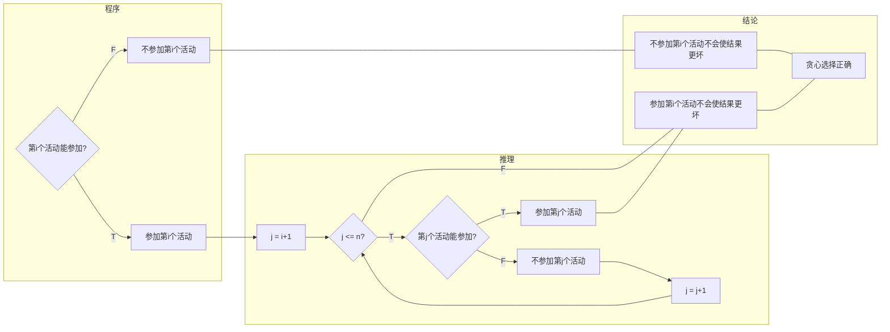

# 16528: 充实的寒假生活

greedy/dp, cs10117 Final Exam, http://cs101.openjudge.cn/practice/16528/

寒假马上就要到了，龙傲天同学获得了从第0天开始到第60天结束为期61天超长寒假，他想要尽可能丰富自己的寒假生活。
现提供若干个活动的起止时间，请计算龙同学这个寒假至多可以参加多少个活动？注意所参加的活动不能有任何时间上的重叠，在第x天结束的活动和在第x天开始的活动不可同时选择。

**输入**

第一行为整数n，代表接下来输入的活动个数(n < 10000)
紧接着的n行，每一行都有两个整数，第一个整数代表活动的开始时间，第二个整数代表全结束时间

**输出**

输出至多参加的活动个数

样例输入

```
5
0 0
1 1
2 2
3 3
4 4
```

样例输出

```
5
```

来源：cs10117 Final Exam


与4100题目一样。

数据量过小，可以$O(nm)$dp。这个+1，设置的很巧妙。

```python
# 高景行 24数学科学学院
n = int(input())
a = []
for i in range(n):
    x, y = map(int, input().split())
    a.append((x + 1, y + 1))
a = sorted(a, key = lambda _: _[0])
dp = [0] * 65
for i in range(n):
    for j in range(a[i][1], 62):
        dp[j] = max(dp[j], dp[a[i][0] - 1] + 1)
print(dp[61])
```


**要求dp实现一次，greedy实现一次。**这个题目，初看用不了dp，数据预处理一下就可以了，因为dp不排斥数据预处理。


2020fall-cs101-苏荣薰，Greedy解题思路：只要按照结束时间排序，然后参加第一个活动，接下来的活动能参加就参加。因为这样的话不会使结果更坏，能参加尽量多的活动。假设最优解并不包括第一个结束的活动，那么最优解中第一个活动必然可以替换成第一个结束的活动，选择参加第一个结束的活动不会使结果更坏。

解题思路：随时间减少，可参加的活动数量也减少，因此应当以结束时间排序（如果选最先开始的，最短时间的活动都会出现问题）。排序后第一个活动一定能参加，使用贪心算法，选择开始时间晚于上一次结束时间的事件，次数加 1。

区间问题，Greedy。按照结束时间排序，然后看找下一个起始时间不超过结束时间的区间，一直贪心。

```python
n = int(input())
m = [[int(x) for x in input().split()] for i in range(n)]
for i in range(n):
    m[i][0], m[i][1] = m[i][1], m[i][0]
m.sort()
y = 1
a = m[0][0]
for i in range(n-1):
    if m[i+1][1]>a:
        y += 1
        a = m[i+1][0]
print(y)
```

Greedy

```python
n = int(input())
s = [[int(x) for x in input().split()] for _ in range(n)]
s.sort(key = lambda x:x[1])

m = s[0][1]
a = 1
for i in range(1,n):
    if s[i][0] > m:
        a += 1
        m = s[i][1]

print(a)
```


dp解法，“最大上升子序列和”思路。dp前，数据预处理，如果开始时间一样，保留结束时间最早的活动。因为至少可以参加一个活动，所以dp初始化为1.

```python
n = int(input())
act = [None]*61
for _ in range(n):
    s,e = map(int, input().split())
    if act[s]==None:
        act[s] = e
    elif act[s] > e:
        act[s] = e

dp = [1]*61
for i in range(61):
    if act[i]!=None:
        for j in range(i):
            if act[j]!=None and act[j]<i:
                dp[i] = max(dp[i], dp[j]+1)
print(max(dp))
```


dp，就是把不可能的情况剔除了，从头扫描一遍。字典中保存的是，如果结束时间一样，保留开始时间晚的。另外，单独处理开始时间是0的活动。

体会：dp类题目，除了递推公式，开始前的的数据预处理还是挺重要的。例如：OJ16528 充实的寒假生活，字典中保存的是，如果结束时间一样，保留开始时间晚的。

2020fall-cs101，蔡清远。本题dp应该有两个思路：一是以时间作为状态转移变量，dp[t]表示前t天内所能参加的最大活动数，时间复杂度 O(max(T))，而这样做需要巧妙的数据预处理，即构建一个活动结束时间与最晚开始时间的映射表（此处包含一步贪心，开始时间晚使任务覆盖时间更短，不会使结果更坏）。二是以考虑的活动数作为状态转移变量，在对活动结束时间排序后，dp[i]代表考虑前i个活动时，所能参加的最大活动数，时间复杂度 O(n^2^)，即使考虑到可以用二分搜索简化，时间复杂度也为 O(nlogn)。因此，就本题数据范围而言，无疑应当使用第一种方法。

```python
n = int(input())
event = [-1] * 61
for x in range(n):
    start, end = map(int, input().split())
    event[end] = max(event[end], start)
    
dp = [0]*61
for t in range(61):
    if event[t] == -1:
        dp[t] = max(dp[t], dp[t-1])
    else:
        dp[t] = max(dp[t], dp[t-1], dp[event[t] -1] +1)	#不取这次活动，取这次活动。类似背包

print(dp[60])
```


```python
n = int(input())
activity = {}
for _ in range(n):
    s,e = map(int, input().split())
    if e not in activity:
        activity[e] = s
    elif activity[e] < s:
        activity[e] = s

ans = end = 0
for i in range(0,61):
    if (ans==0) and (i in activity) and (activity[i]==0):
        ans = 1
        end = i
        continue

    if (i in activity) and (activity[i]>end):
        ans += + 1
        end = i

print(ans)
```


2020fall-cs101，赵春源代码，安磊解说思路。

借鉴了赵春源同学的代码。res[i]代表截止到前 i天参加的活动数。ans[i]代表第 i个活动参加时可以参加的活动总数。假设某个活动开始的时间为 k，则它的前 k天举办的最大活动数再加上 1即为考虑了该活动之后的活动总数。如果这个活动是从第零天开始的，那么只能参加这一个活动，ans即等于 1。如此递推即可。需要注意的是在参加了第 i个活动之后，必须更新第 i个活动截止日期之前的活动总数。

```python
n = int(input())
lis = []
for i in range(n):    
    a,b = map(int,input().split())    
    lis.append((a,b))
lis.sort(key = lambda x:x[0])
res = [0] * 61
ans = [0] * n
for i in range(n):
    if lis[i][0] > 0:        
        ans[i] = max(res[:lis[i][0]]) + 1
    else:        
        ans[i] = 1    
    
    res[lis[i][1]] = max(ans[i],res[lis[i][1]])
    
print(max(ans))
```

2021fall-cs101，吉祥瑞

http://cs101.openjudge.cn/practice/16528/

解题思路：贪心策略是按结束时间从早到晚遍历每个活动，若能参加就参加。原理如下图。



```python
n = int(input())
se = [[int(x) for x in input().split()] for _ in range(n)]
se.sort(key=(lambda x: x[1]))
s = 1
r = se[0][1]
for i in range(1, n):
    if se[i][0] > r:
        s += 1
        r = se[i][1]
print(s)
```

注：用到了二维列表。`r`用来标记已参加的活动的结束时间。


