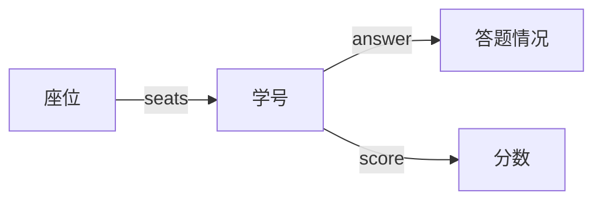

# 16531: 上机考试

matrices, http://cs101.openjudge.cn/practice/16531/

一个班的同学在M行*N列的机房考试，给出学生的座位分布和每个人的做题情况，统计做题情况与周围（上下左右）任一同学相同的学生人数。
另外，由于考试的优秀率不能超过40%，请统计这个班的优秀人数（可能为0，相同分数的同学必须要么全是优秀，要么全不是优秀）。

**输入**

第一行为两个整数，M和N
接下来M行每行N个整数，代表对应学生的编号，编号各不相同，范围由0到M*N-1
接下来M\*N行，顺序给出编号由0到n-1的同学的做题情况，1代表做对，0代表做错。

**输出**

两个整数，以空格分隔；分别代表“与周围任一同学做题情况相同的学生人数”和“班级优秀的人数”

样例输入

```
sample1 input:
2 5
0 1 2 3 4
5 6 7 8 9
1 1 1
1 0 1
0 0 0
0 0 1
0 0 0
1 1 1
1 1 1
1 1 1
1 1 1
1 1 1

sample1 output:
6 0

#编号为0 5 6 7 8 9的同学做题情况与周围同学相同，因此第一个整数是6。
全对的同学人数已经超过了40%，因此优秀的人数为0
```

样例输出

```
sample2 input:
1 3
1 0 2
0 1 0 0
0 0 0 0
0 0 0 0

sample2 output:
0 1

#并不存在与相邻同学做题情况相同的同学，并且做对一题的同学比例小于40%，因此有一人优秀
```

提示

tag: matrix
1）M*N行做题情况可能为空。因为如果所有学生做题过程中，一直没有提交，则空。
2）空行(即ASCII的回车符)。空行与全零不一样，不是“答题情况相同”。
3）考试的题目数不定。

来源

cs10117 Final Exam


思路：以座位为遍历指标，座位所对应的列表值为学号，再用学号去查找做题情况。


2022fall-cs101，陈修安，化学与分子工程学院。

引入了学号，就要把这个映射关系搞清楚。如下图所示：



因为学号从 0 开始，所以保护层用 -1。

还有一个比较 tricky 的就是合格人数的处理。因为是合格率不高于 40%，所以可以从合格人数是全员开始倒过来试。


> 【周晋飞，2020年秋】

```python
m,n = map(int,input().split())
s = [[-1]*(n+2)]
num = s + [[-1]+ [int(x) for x in input().split()]+[-1] for _ in range(m)] + s 
grade = [[int(x) for x in input().split()] for i in range(m*n)]

ans = 0
for i in range(1, m+1):
    for j in range(1, n+1):
        a = num[i][j]
        for b in [num[i-1][j], num[i+1][j], num[i][j+1], num[i][j-1]]:
            if b!=-1 and grade[b]==grade[a]:
                ans += 1
                break
            
gsum = [sum(i) for i in grade]
gsum.sort(reverse = True)
c = [i > gsum[int(m * n *0.4)] for i in gsum]
print(ans, c.count(True))
```


> 【李子安，2018年秋】

```python
# 2018fall-cs101, 李子安
import math
m,n = [int(x) for x in input().split()]
s = [[-1]*(n+2)]
l = s+[[-1]+ [int(x) for x in input().split()]+[-1] for i in range(m)]+s

c = 0
t = [[int(x) for x in input().split()] for i in range(m*n)]

for i in range(1,m+1):
    for j in range(1,n+1):
        a = t[l[i][j]]
        b = [l[i-1][j],l[i+1][j],l[i][j+1],l[i][j-1]]
        for k in b:
            if k!=-1 and t[k]==a:
                c += 1
                break

y = []
for i in range(m*n):
    x = sum(t[i])
    y.append(x)
y = sorted(y,reverse=True)

bound = math.floor(0.4*m*n)
u = 0
if m*n<=2:
    u = 0
elif m*n>2 and y[bound-1]!=y[bound]:
    u = bound
elif m*n>2 and y[bound-1]==y[bound]:
    for i in y:
        if i>y[bound-1]:
            u += 1

print(c,u)
```


